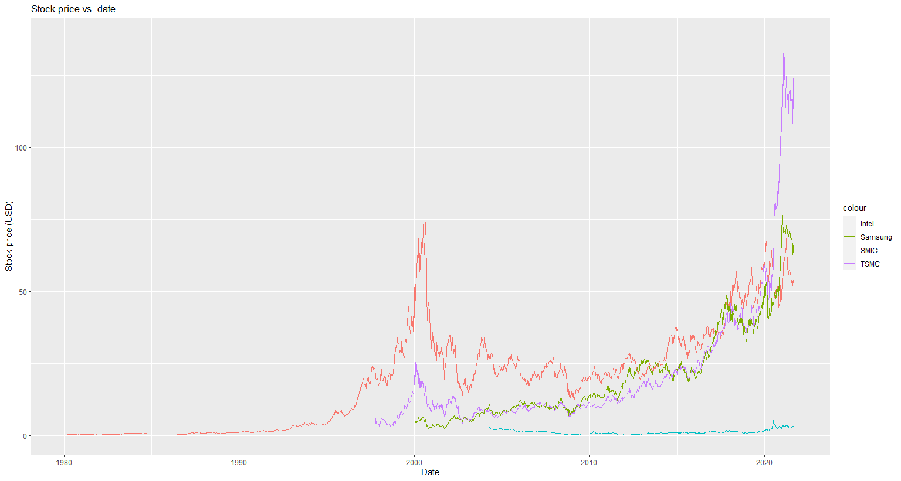
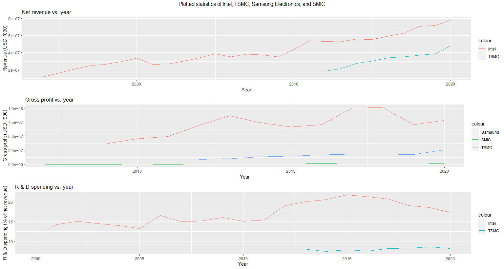

Analysis of Select Semiconductor Industry Companies
====================================================

Motivation
-----------

The semiconductor industry is perhaps the most important industry of the 21st century. It provides
the backbone to most of the advanced technology we almost always take for granted. Without
semiconductors, technology such as mobile phones, computers, and the internet would not be possible.

This project analyzes the relative strengths of some of the most important manufacturers in the 
semiconductor industry; the companies included in this study are Intel, TSMC (Taiwan Semiconductor
Manufacturing Company), Samsung Electronics, and SMIC (Semiconductor Manufacturing International
Corporation).

Abstract
----------

Read the full report/analysis `here <analysis/README.rst>`_.

Running the script
-------------------

Install the R packages listed in the `requirements file <scripts/requirements.rst>`_ before continuing.

To plot the graphs on your own machine, run
`semiconductor_industry_companies_data_visualization.R <scripts/semiconductor_industry_companies_data_visualization.R>`_.

References for Plots
-----------------------

This section serves as a list of the references used to create the plots. Refer to the
`report <./analysis/README.rst>`_ for a complete list of sources, including sources used to
create the report.

Intel
~~~~~~

**Revenue, R & D spending**: `Financial Results <https://www.intc.com/financial-info/financial-results>`_

**Stock price**: `Yahoo Finance <https://finance.yahoo.com/quote/INTC/history?period1=322099200&period2=1630713600&interval=1wk&filter=history&frequency=1wk&includeAdjustedClose=true>`_

TSMC
~~~~~

**Revenue, profit, R & D spending**: `Annual Reports <https://investor.tsmc.com/english/annual-reports>`_

**Stock price**: `Yahoo Finance <https://finance.yahoo.com/quote/TSM/history?period1=876355200&period2=1630713600&interval=1wk&filter=history&frequency=1wk&includeAdjustedClose=true>`_

Samsung
~~~~~~~~

**Profit**: `Financial Statements <https://www.samsung.com/global/ir/financial-information/audited-financial-statements/>`_

**Stock price**: `Yahoo Finance <https://finance.yahoo.com/quote/005930.KS/history?period1=946857600&period2=1630713600&interval=1wk&filter=history&frequency=1wk&includeAdjustedClose=true>`_

SMIC
~~~~~

**Profit**: `Financials <https://www.smics.com/en/site/company_financialSummary>`_

**Stock price**: `Yahoo Finance <https://finance.yahoo.com/quote/0981.HK/history?period1=1079481600&period2=1630713600&interval=1wk&filter=history&frequency=1wk&includeAdjustedClose=true>`_

Third Party Software
----------------------

- `here <https://here.r-lib.org/>`_ (MIT License): Library for making file referencing easier.

- `rio <https://cran.r-project.org/web/packages/rio/index.html>`_ (GPL-2): File input/output.

- `dplyr <https://dplyr.tidyverse.org/>`_ (MIT License): Data manipulation library.

- `ggplot2 <https://ggplot2.tidyverse.org/>`_ (MIT License): Plotting library.

- `gridExtra <https://cran.r-project.org/web/packages/gridExtra/index.html>`_ (GPL-2 | GPL-3): Grid graphics manipulation.

The ``grid`` library comes included with R.

License
----------

My `analysis <analysis/README.rst>`_ is licensed under the `Creative Commons Attribution 4.0 
International license <https://creativecommons.org/licenses/by/4.0/>`_.

The source code used to create the plots is licensed under the `MIT License <LICENSE.txt>`_.
