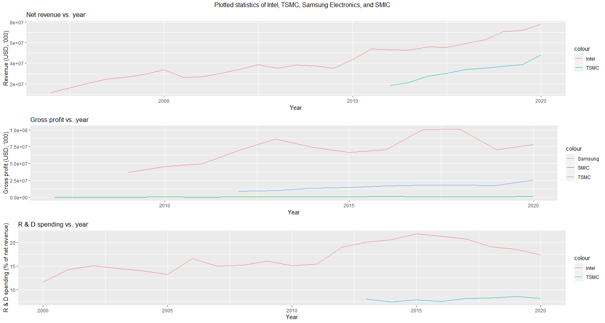

Analysis of Select Semiconductor Industry Companies
=====================================================

Introduction
-------------

The semiconductor industry is perhaps the most important industry of the 21st century. It provides
the backbone to most of the advanced technology we almost always take for granted. Without
semiconductors, mobile phones, computers, and the internet would not be possible.

So, I wanted to try to explain the statistics of some of the most advanced companies in the world.

.. image:: ../images/Stock_prices.png

Notice how TSMC's stock price is leagues ahead of SMIC, Intel, or even Samsung. The likeliest reason for this is because
TSMC (Taiwan Semiconductor Manufacturing Corporation) is simply the most advanced chip maker on the planet.

It should be noted that SMIC (Semiconductor Manufacturer International Corporation), the largest
Chinese semiconductor manufacturing company (citation missing), has the lowest, stock price of the four. If that is
any indication of the state of China's semiconductor industry, despite the massive state investments poured into
semiconductors, then China's nascent semiconductor industry is still leagues behind its North American and Asian counterparts.

"Without prior expertise you are lost", says The Economist ("The Pivot"). China would do well to remember that.

Samsung's astronomical profit can be attributed to how it is not purely a semiconductor
manufacturing company;

References
-----------

::
	"The Pivot." *The Economist*, 21 December 2019 - 3 January 2020, 29-30.
	
	
